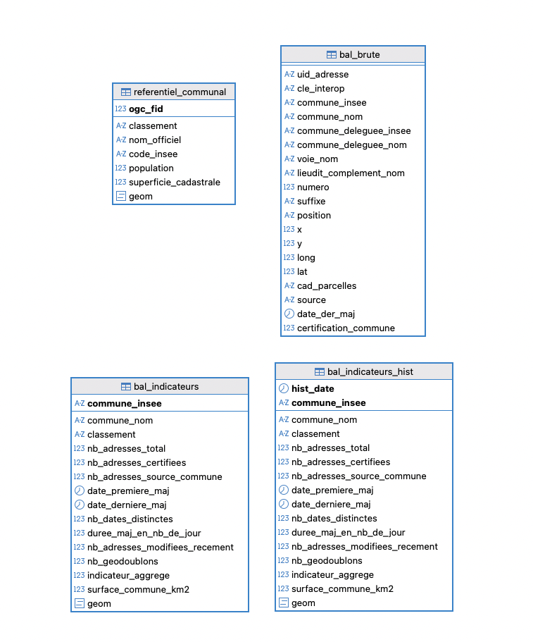

# Tableau de bord d'analyse de qualité de la Base Adresse Nationale

## Objectif : décrire la vitalité des BAL

On se propose de décrire l'activité d'une BAL à l'aide de plusieurs indicateurs complémentaires.

Proposition d'indicateurs 
- Longévité de la BAL : durée entre la 1ère date de mise à jour et la dernière date. Donne un aperçu de l'ancienneté de la BAL
- Nombre de dates distinctes de mises à jour : permet d'estimer la régularité de la mise à jour au fil du temps.
- Nombre d'adresses mises à jour depuis 2 ans : pour quantifier les mises à jour récentes de la BAL, donne un aperçu de l'activité actuelle de la BAL.
- Taux de certification des adresses.
- Taux d’adresses de source communale.
- Nombre d'adresses superposées les unes aux autres : "géodoublons", caractéristiques d'une BAL qui n'a pas été "nettoyée" des anciennes adresses du cadastre.

## Installation

Voir le [README](installation/README.md) dans le répertoire `installation`.

## Utilisation

### Création des tables

Exécuter le script d'import :
 
    ./creer_tables.sh

### Configuration du référentiel communal

Les limites des communes sont nécessaires pour cartographier les indicateurs. On a également besoin du classement par densité des communes pour affiner l'indicateur aggrégé.

- IGN pour le contour des communes : https://geoservices.ign.fr/telechargement-api/ADMIN-EXPRESS-COG-CARTO-PE?zone=FXX&format=GPKG

- INSEE pour le classement par densité des communes : https://www.insee.fr/fr/information/8571524

Exécuter le script d'import :
 
    ./import_contour_communes.sh

/!\ Attention, pour le moment, les limites des communes avec arrondissements n'est pas récupéré dans le fichier insee.

    

### Import des fichiers BAL

Lancer le script pour importer la France entière :

    ./import_bal_csv.sh

Ou sur un seul département :

    ./import_bal_csv.sh -dpt 29

Attention, pour le fichier BAL France entière, l'import dure un petit quart d'heure.

### Création des indicateurs

Une fois les 2 étapes précédentes réalisées, on peut générer la table des indicateurs qualité par commune : 

    ./calculer_indicateurs.sh

Pour la france entière, le traitement dure une dizaine de minutes.

Ou pour mettre un jour un seul département :

    ./calculer_indicateurs.sh -dpt 29

### Export de la table des indicateurs en geojson

Une fois la table des indicateurs créée dans Postgresql, on peut l'exporter en geojson. Cela permet par exemple de l'intégrer dans UMap : 

    ./export_indicateurs_en_geojson.sh
    
Le fichier résultat se trouve dans le dossier "out".

## Exploitation

### Carte synthétique

On peut agréger les indicateurs en un seul, selon une pondération à affiner.
L'indicateur aggrégé est calculé à la fin du script `create_table_bal_indicateurs.sql`.

## Historisation

Lancer ce script pour créer un point d'historisation des indicateurs (à lancer par cron 1x par mois) :

    ./creer_historique.sh

## Modèle de données

